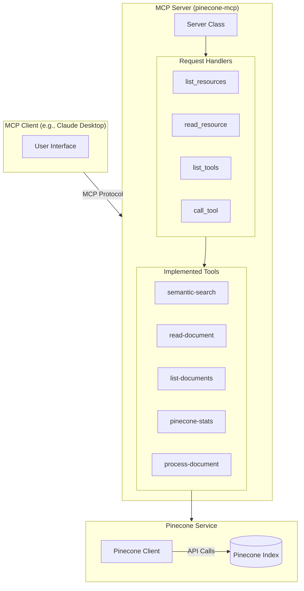

# Pinecone MCP Server

    
    <h2>Model Context Protocol Server for Pinecone Vector Database</h2>
    
<em>Empowering AI with powerful vector search capabilities</em>

---

## 📚 What is Pinecone MCP Server?

The Pinecone MCP Server is a Model Context Protocol (MCP) implementation that connects AI models to [Pinecone](https://www.pinecone.io/), a high-performance vector database designed for similarity search. This server enables AI assistants to store, retrieve, and query vector embeddings, facilitating semantic search, recommendations, and knowledge retrieval from unstructured data.

---

## 🌟 Key Features

- **Semantic Search** - Find contextually similar content using vector embeddings
- **Document Processing** - Convert documents into searchable vector representations
- **Knowledge Retrieval** - Access relevant information based on semantic similarity
- **Vector Management** - Store and organize vector embeddings efficiently
- **Integration with LLMs** - Enhance AI capabilities with relevant context

---

## 🛠️ Capabilities

| Capability | Description |
|------------|-------------|
| **semantic-search** | Search for semantically similar content in the vector database |
| **read-document** | Retrieve specific documents from the Pinecone index |
| **list-documents** | View available documents in the Pinecone database |
| **pinecone-stats** | Get statistics about your Pinecone index usage and performance |
| **process-document** | Convert and index new documents into searchable vectors |

---

## 🔧 Technical Architecture

---

## 🚀 Use Cases

- **Knowledge Base Access** - Enable AI to search and retrieve from extensive knowledge bases
- **Question Answering** - Find relevant context to answer specific questions accurately
- **Content Recommendation** - Suggest similar content based on semantic relationships
- **Data Exploration** - Navigate large datasets using natural language queries
- **RAG Applications** - Power Retrieval-Augmented Generation for more grounded AI responses
- **Document Management** - Organize and search documents by content rather than metadata

---

## 🔐 Security and Configuration

- **API Key Management** - Secure handling of Pinecone API credentials
- **Index Configuration** - Flexible configuration for different Pinecone indexes
- **Dimension Settings** - Support for various embedding dimensions and types
- **Namespace Support** - Organize vectors in different namespaces within an index
- **Query Controls** - Configure top-k retrieval and similarity thresholds

---

## 💻 Implementation Details

- Built on the official Pinecone Python client
- Supports multiple embedding models for vector generation
- Implements efficient vector upsert and query operations
- Handles large-scale document processing with chunking
- Provides metrics and diagnostics for performance optimization

---

    
<strong>Pinecone MCP Server</strong> - Bringing vector search capabilities to AI models

